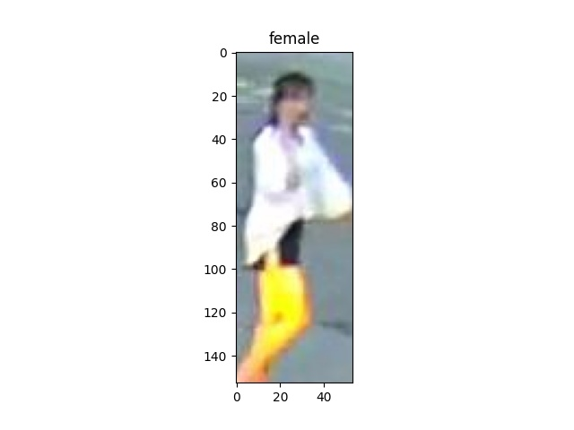
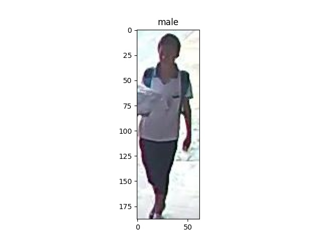

# example-classifier

## Prepare dataset
Train two class (female and  male)
```
gender/
├── train
│   ├── female
│   │     ├── xxx.jpg
│   │     └── xxx.jpg
│   └── male
└── val
    ├── female
    └── male
```

The training dataset contains 6500 female and 6500 male.  
The val dataset contains 500 female and 500 male.

## Train
```
python train.py --dataet gender --epochs 100 --batch-size 128 --height 256 --width 128
```

## Val
| net | female | male |
| ------ | ------ | ------ |
| resnet50 | 80.4 % | 87.6 % |

<table border="0">
<tr>
    <td>
    
    </td>
    <td>
    
    </td>
</tr>
</table>
